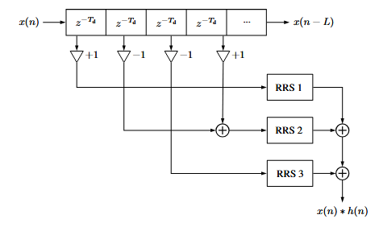
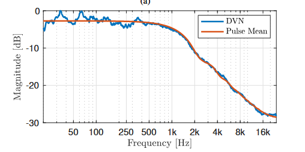
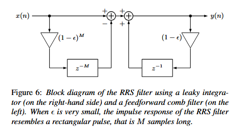

 # Architecture

## Dark Velvet Noise (DVN) Convolvers

Dark Velvet Noise (DVN) is used in the **early diffusion stage** of the reverb. It extends *Velvet Noise*, which is a sparse sequence of randomly signed impulses (+1 or –1), by giving each pulse a **randomized width** instead of a fixed single sample. This simple change produces a lowpass spectral shaping — removing excess high-frequency content and creating a warmer, more natural character in the early reflections. The density of pulses controls the cutoff frequency of the effective lowpass roll-off.




**Mathematical Foundation:**
A DVN sequence h(n) is defined by M pulses, each characterized by three randomized parameters:

- **Pulse width:** `w(m) = ⌊r₁(m)(w_max - w_min) + w_min⌉` where r₁ ∈ [0,1]
- **Pulse position:** `k(m) = ⌊mT_d + r₂(m)(T_d - w(m))⌉` where r₂ ∈ [0,1]  
- **Pulse polarity:** `s(m) = 2⌊r₃(m)⌉ - 1` where r₃ ∈ [0,1] (yields ±1)

Where T_d = f_s/ρ is the temporal grid spacing determined by pulse density ρ.

**DVN Sequence Definition:**
The DVN sequence is given as:
```
h(n) = { s(m) for k(m) ≤ n < k(m) + w(m),
         0 otherwise }
```

Note that for pulse width w(m) ≡ 1, the DVN sequence is equivalent to Original Velvet Noise (OVN).

**Spectral Characteristics:**
The spectral shape of DVN is determined by the rectangular pulses contained in the sequence. The roll-off is approximately 6 dB/octave, resembling a first-order lowpass filter. The mean pulse spectrum is:

```
|H(ω)| = (Σ(i=w_min to w_max) |W_i(e^(jω))|) / (w_max - w_min + 1)
```



where |W_i(e^(jω))| is the magnitude spectrum of the rectangular pulse with width w = i.

**Filtering Structure:**
DVN filtering requires exactly as many RRS filters as there are unique pulse widths w(m). For f_s = 48 kHz and ρ = 2000:
- Grid size T_d = 24 samples (maximum pulse width)
- Maximum of 24 RRS filters needed regardless of sequence length M
- Computational cost: 4 × (number of unique widths) FLOPS per sample

**Implementation Structure:**
The block diagram shows a multi-tap delay line where:
- Each z^(-T_d) block has a single jittered output tap
- ±1 gain blocks randomize the sign s(m) of each pulse  
- Pulses are randomly routed to RRS filters based on their width
- The convolution result is the sum of all RRS filter outputs
- Total computational cost depends on pulse density ρ and length L

## Recursive Running-Sum (RRS) Filters

The **RRS filter** efficiently implements the effect of rectangular pulses without performing full convolution. Conceptually, it combines a leaky integrator with a feedforward comb filter. This makes it possible to simulate rectangular pulse responses using only a handful of operations.



**Mathematical Model:**
The RRS filter implements the difference equation:
```
y[n] = (1 - ε) × y[n-1] + x[n] - (1 - ε)^M × x[n-M]
```

Where:
- ε is a small leakage coefficient (typically ε = 2^(-12) ≈ 2.441 × 10^(-4))
- M is the pulse width in samples
- (1 - ε)^M is precomputed for efficiency

**Block Diagram Structure:**
The RRS filter consists of:
- **Feedforward comb filter (left side):** Implements x[n] - (1-ε)^M × x[n-M]
- **Leaky integrator (right side):** Implements the recursive term (1-ε) × y[n-1]
- **Delay elements:** z^(-M) for the M-sample delay and z^(-1) for the 1-sample delay

**Computational Efficiency:**
Each RRS filter requires only:
- One addition
- One subtraction  
- Two multiplications
- **Total: 4 operations per sample regardless of pulse width M**

**Impulse Response Characteristics:**
When ε is very small, the impulse response resembles a rectangular pulse that is M samples long. The leaky implementation with small ε results in:
- Slow exponential decay along the impulse response
- Numerical stability (avoiding the hidden pole at DC)
- Negligible spectral deviation from perfect rectangular pulse

**Practical Implementation:**
- The leakage factor ε = 2^(-12) provides conservative numerical stability
- Floating-point implementation requires the leaky integrator to avoid instability
- The falling edge of the impulse response goes to zero with controlled decay

## Feedback Delay Network (FDN)

The **Feedback Delay Network (FDN)** is the core structure responsible for generating dense, natural-sounding late reverberation. It consists of multiple recirculating delay lines interconnected through a **feedback matrix**, which determines how energy flows from one delay line into all the others.

Using an **orthogonal feedback matrix** ensures the system is **lossless**, meaning energy is preserved inside the network until explicitly attenuated by filters. This allows precise control of decay through attenuation filters and ensures dense diffusion of echoes. In this implementation, a **Hadamard matrix** is used for the feedback structure — it is orthogonal, computationally efficient, and spreads energy evenly across all delay lines.


**Mathematical Model:**
The output sample y(n) of the recursive system for an input x(n) is:

```
y(n) = Σ(i=1 to N) c_i s_i(n + m_i)
```

where the delay line states are:

```
s_i(n) = Σ(j=1 to N) A_ij g_j s_j(n) + b_i x(n)
```

Where:
- b_i and c_i are the input and output coefficients, respectively
- A_ij is the feedback matrix element
- g_i is the attenuation gain for delay line i
- s_i are the output states of each delay line
- m_i are the delay lengths

**Transfer Function:**
The FDN transfer function is:

```
H(z) = Y(z)/X(z) = c^T [D_m(z)^(-1) - A]^(-1) b
```

where:
- b and c are vectors containing input and output gains
- D_m(z) = diag[G₁(z)z^(-m₁), G₂(z)z^(-m₂), ..., G_N(z)z^(-m_N)]
- A is the feedback matrix
