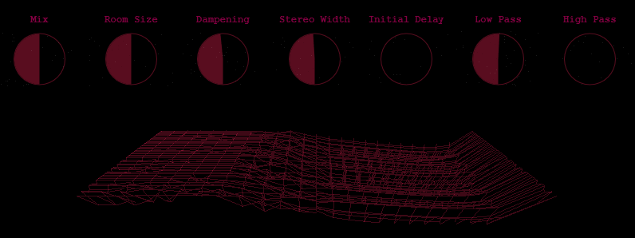
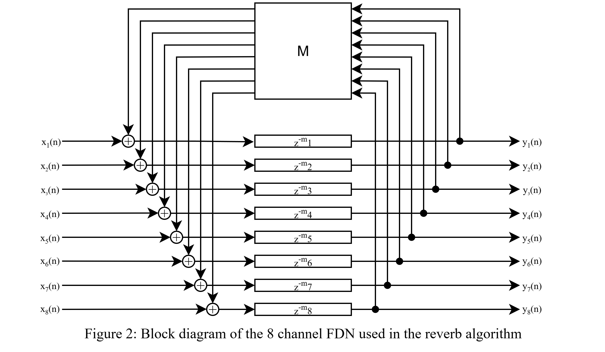
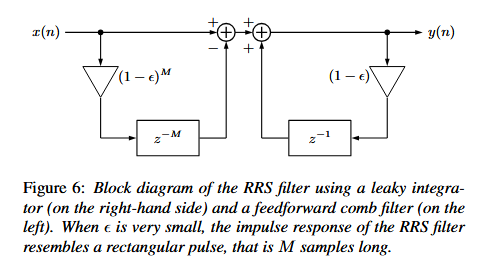

# Readme

**Note:** This plugin has some stability issues including volume spikes during parameter changes, system freezing during parameter automation, and high CPU usage (75-85% constant usage). Not recommended for live performance.

8-channel reverb audio plugin with real-time 3D spectrogram visualization, implemented in C++ using JUCE.

[](Docs/images/ui-screenshot.png)

## Features

- **8-channel audio processing** with parallel diffusion and feedback networks
- **Real-time 3D spectrogram** visualization using OpenGL
- **Advanced reverb algorithm** combining Dark Velvet Noise diffusers and dual Feedback Delay Networks
- **Comprehensive controls** for mix, dampening, pre-delay, filtering, room size, and stereo width

## Quick Start

### System Requirements

- **Windows 11** (untested on other platforms)
- **JUCE Framework 8.0.8**
- **Visual Studio 2022** with C++ build tools
- **16GB RAM minimum** (tested configuration)
- **Modern CPU** (tested: AMD Ryzen 5 2600, 6-core, 3.4GHz)
- **OpenGL-capable graphics**

### Installation

1. **Build from source:**
   ```
   1. Install JUCE Framework 8.0.8 and Visual Studio 2022
   2. Open project in Projucer
   3. Generate Visual Studio files
   4. Build in Visual Studio (Debug or Release)
   ```

2. **Install plugin:**
   ```
   Copy the .vst3 folder from:
   Builds\VisualStudio2022\x64\[Debug|Release]\VST3
   
   To:
   C:\Program Files\Common Files\VST3
   ```

3. **Verify installation:**
   - Restart your DAW
   - Look for "Reverb Plugin" in your VST3 effects list
   - **Tested only in REAPER v7.33 (WinX64)**

### Basic Usage

1. **Start with low mix values** (10-20%) to avoid volume spikes
2. **Avoid heavy automation** - make parameter changes slowly and sparingly
3. **Limit other effects** - avoid using with many other plugins due to high CPU usage
4. **Monitor and keep volume low** - watch levels carefully during parameter adjustments

### Audio Demos

- **Dry Signal:** [Listen](Docs/audio/dry.wav)
- **Wet Signal (Reverb Applied):** [Listen](Docs/audio/wet.wav)

## Controls

| Parameter | Range | Description |
|-----------|-------|-------------|
| **Mix** | 0-100% | Blend between dry (0%) and wet (100%) signal |
| **Stereo Width** | 0.0-2.0 | Controls stereo separation amount |
| **Low Pass** | 20-20,000 Hz | Attenuates frequencies above cutoff |
| **High Pass** | 20-20,000 Hz | Attenuates frequencies below cutoff |
| **Room Size** | 0.1-2.0 | Scales delay lengths to simulate room dimensions |
| **Dampening** | 20-20,000 Hz | Low-pass filter cutoff for delay feedback paths |
| **Initial Delay** | 0.0-0.1 seconds | Delay before reverb processing begins |

## Technical Architecture

### Core Components

| Component | Purpose |
|-----------|---------|
| **Diffuser** | Convolves input with Dark Velvet Noise sequences |
| **Feedback Delay Network (FDN)** | Interconnected delay lines with Hadamard matrix feedback |
| **FFTProcessor** | Real-time spectrum analysis (1024-sample FFT, 512 frequency bins) |
| **Spectrogram3DComponent** | OpenGL-based 3D visualization renderer |

### Signal Flow

```
Input Audio
    ↓
Pre-delay
    ↓
High/Low Pass Filters
    ↓
Upscale to 8 Channels
    ↓
Diffuser 1 (Dark Velvet Noise)
    ↓
Feedback Delay Network 1
    ↓
Diffuser 2 (Dark Velvet Noise)
    ↓
Feedback Delay Network 2
    ↓
Diffuser 3 (Dark Velvet Noise)
    ↓
Stereo Width Processing
    ↓
Mix with Dry Signal
    ↓
Output Audio
```

### Feedback Delay Network (FDN)

The **Feedback Delay Network (FDN)** is a method for creating dense, natural-sounding reverberation. It consists of multiple delay lines that recirculate audio and are interconnected through a **feedback matrix**. This matrix determines how the output of each delay line feeds into the others.

- **Recirculating delay lines:** Each delay line produces echoes, and its output is routed back into the network.  
- **Feedback matrix:** Controls the gains of each connection between delay lines. Using an **orthogonal matrix** ensures the network is **lossless**, meaning no energy is lost as sound circulates.  
- **Hadamard matrix:** In this implementation, a **Hadamard matrix** is used as the feedback matrix because it is orthogonal and computationally efficient.  
- **Energy redistribution:** The orthogonal matrix spreads the output of one delay line to all the delay lines, creating a rich and even decay.  
- **Decay control:** The overall decay rate can be set using a target **reverberation time (T60)**, which is the time it takes for the reverb to decay by 60 dB.

[](Docs/images/FDN.jpg)


### Dark Velvet Noise (DVN)

Dark Velvet Noise is a computationally efficient approach to late reverberation modeling:

- **Velvet Noise:** Sparse, pseudo-random sequence similar to white noise
- **Dark Velvet Noise:** Low-pass filtered velvet noise for warmer character
- **Implementation:** Multi-tap delay line with Recursive Running-Sum (RRS) filters
- **Efficiency:** Fewer operations than traditional convolution methods

### Recursive Running-Sum (RRS) Filter

Implements rectangular pulse responses efficiently:

```
y[n] = (1 - ε) * y[n-1] + x[n] - (1 - ε)^M * x[n-M]
```

Where ε is a small value and M is the pulse length in samples.

[](docs/images/RRS.png)


### 3D Spectrogram

The plugin includes a real-time 3D visualization showing frequency content over time:

- **X-axis:** Frequency (logarithmic scale, 25 points)
- **Y-axis:** Magnitude (-60dB to 0dB range)
- **Z-axis:** Time (50 frames of history, 30Hz refresh rate)
- **Rendering:** Wireframe display in velvet red with transparency
- **Performance:** OpenGL with VBO optimization for efficiency

[](Docs/gifs/spectrogram-demo.gif)

### Performance Optimizations

- **OpenMP parallelization** for multi-channel processing
- **VBO rendering** for efficient GPU utilization
- **Thread-safe FFT processing** with critical sections
- **Magnitude filtering** to skip rendering quiet signals
- **Limited DVN pulses** (200 maximum) for real-time constraints

## Known Issues

- **High CPU usage:** 75-85% constant usage regardless of audio state
- **Volume spikes:** Rapid parameter changes can cause sudden volume increases
- **System freezing:** Parameter automation may cause temporary system lag
- **Limited compatibility:** Only tested on Windows 11 with REAPER v7.33

## Development Notes

### Known Limitations

- **Platform:** Windows-only, untested on macOS/Linux
- **DAW compatibility:** Only tested in REAPER v7.33
- **Stability:** Not recommended for live performance
- **CPU efficiency:** High baseline usage regardless of audio state
- **Parameter safety:** Volume spikes during rapid parameter changes

### Build Requirements

- **C++17 standard**
- **JUCE Framework 8.0.8**
- **OpenMP support**
- **OpenGL drivers**
- **Visual Studio 2022** with C++ build tools

## References

### Resources
- Fagerström, J., Meyer-Kahlen, N., Schlecht, S., & Välimäki, V. (2022). Dark Velvet Noise
- Fagerström, J., Alary, B., Schlecht, S., & Välimäki, V. (2020). Velvet-Noise Feedback Delay Network
- **Let's Write A Reverb** - Signalsmith Audio tutorial series

### Frameworks
- **JUCE Framework** - Audio plugin development platform
- **OpenMP** - Multi-threading library

## License
This project is licensed under the [MIT License](LICENSE.md).
---

**Disclaimer:** This is experimental software. Use appropriate gain staging and monitor levels carefully. Always test thoroughly before any critical use.
